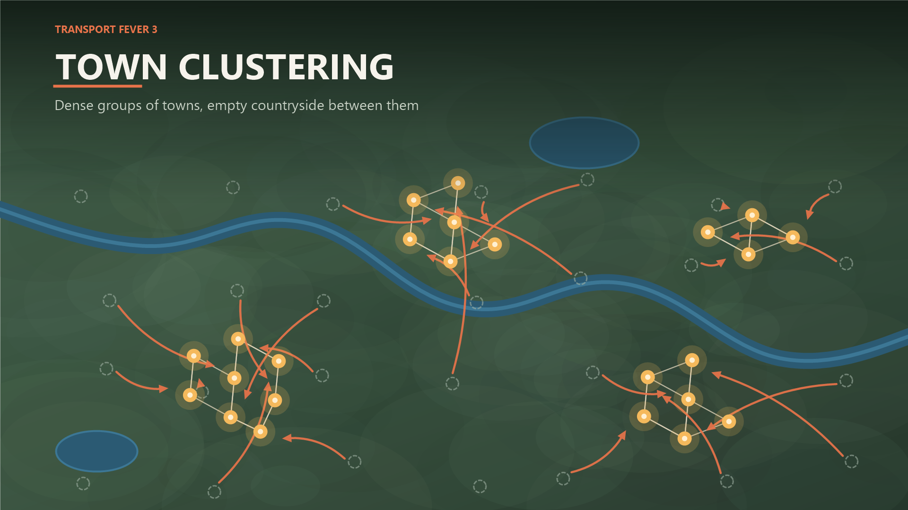

# Town Clustering

A mod for **Transport Fever 3**. The stock map generator spreads towns evenly
across the map; this mod leaves dense groups of towns separated by empty
countryside, which gives inter-city lines somewhere to actually go.



## How it works

Towns are placed natively in C++ while the new game dialog is open, and no mod
code runs in the menu, so there is no hook for *placing* towns differently.

So the mod lets generation finish untouched and rearranges afterwards, on the
first tick of the new game:

1. Pick cluster centres by farthest-point sampling, so they spread across the
   map without needing to know the map size.
2. Give each cluster a size: weights from a geometric series, so one
   conurbation dominates, a couple are middling and one is a modest group.
3. Leave the towns nearest a centre exactly where they are, up to that
   cluster's share.
4. Rebuild each remaining town next to a cluster, on a spot checked for water,
   slope and elbow room first.
5. Leave a few out in the country and scale them down, so they read as outlying
   hamlets.
6. Lay out the inter-town road network again, stitching the clusters together so
   every town stays reachable.

**Cluster Sizes** is why the map does not look generated. Equal clusters are a
giveaway, so by default one conurbation dominates and the rest trail off. The
exact shape is drawn per map and which centre gets the big one is shuffled, so
the same setting looks different on a different seed:

| Setting  | Largest vs smallest, 40 towns in 4 clusters |
|----------|---------------------------------------------|
| Equal    | 1.2x - the same size bar rounding           |
| Mild     | 1.2x to 2x                                  |
| Varied   | 3.5x to 4x (default)                        |
| Lopsided | 4.5x to 5x - one city region, small satellites |

**The town count never changes** - towns are relocated, not deleted, so your Town
Density setting still means what it says. Terrain, rivers and industries are
left exactly as the stock generator made them.

## Settings

| Setting             | Values                       | Meaning                                               |
|---------------------|------------------------------|-------------------------------------------------------|
| Cluster Count       | 2 / 3 / 4 / 5 / 6 / 8        | How many groups to form                               |
| Cluster Sizes       | Equal / Mild / Varied / Lopsided | How much the clusters differ in size              |
| Towns Left In Place | 30% / 45% / 60% / 75% / 100% | Share that keeps its generated position; the rest move |
| Isolated Towns      | None / 5% / 10% / 20%        | Share of the moved towns left standing alone          |

No need to touch Town Density: the mod moves towns rather than removing them, so
the count you chose is the count you get.

## Installing

```powershell
.\deploy.ps1
```

Then restart the game - mods are read at startup. Enable *Town Clustering* in the
mod list before starting a new game.

The mod only needs to be active when the game starts; afterwards it does nothing
and can safely be removed from the savegame. It changes the world, so it is not a
cosmetic mod and achievements stay disabled while it is active. Adding it to an
established save does nothing at all - it refuses to run once more than ten game
days have passed, rather than rebuild towns out from under you.

## Publishing

Publishing goes through the in-game mod manager (mod.io), which only reads the
**staging area** - not the mods folder:

```powershell
.\deploy.ps1 -Staging     # copy to staging_area\
.\deploy.ps1 -Validate    # copy, then run the game's own mod validator
```

Then open the Mod Manager in-game, validate and publish from the staging entry.
The validator grades PC and console separately, so a mod that is fine on PC can
still report console-only problems.

`mod.json` → `url` and `_metadata/modinfo.json` → `url` stay empty until the
mod.io page exists; fill both in afterwards.

`_metadata/0.png` is the listing image, 1920×1080 to match the shipped mods. It
is a drawn illustration, **not a screenshot** - see below.

## Repository layout

```
mod/town_clustering_1/      the publishable mod; deploy.ps1 installs this
  mod.json                  manifest: id, revision, params, severities
  _content.json             content file list
  _metadata/modinfo.json    name, summary, description, authors, tags
  _metadata/0.png           listing image (1920×1080)
  content/town_clustering.gs.lua     registers the game script
  content/town_clustering.script.tl  the clustering itself
art/listing-pruned.png      listing image for the older pruning behaviour
tools/make_listing_image.ps1  redraws the listing image
NOTES.md                    reverse-engineered TF3 modding notes
```

### The listing image

`tools/make_listing_image.ps1` draws it with GDI+, so it can be regenerated
rather than re-edited by hand. It is a stylised map, not a capture of the game -
there is no real screenshot in this repository yet. Two variants:

```powershell
.\tools\make_listing_image.ps1 -Variant arrows   # towns pulled together (current 0.png)
.\tools\make_listing_image.ps1 -Variant pruned   # towns between clusters struck out
```

`arrows` is the accurate one, and is what `0.png` holds: the mod really does move
towns together, and keeps the count the same. `pruned` depicts the earlier
behaviour, when towns between the clusters were deleted outright; it is kept
because it shows more plainly where the empty countryside comes from.

Replace either with a real annotated in-game screenshot when there is one.

## Development

No Lua or Teal toolchain is installed; the game compiles `.tl` at load time and
reports failures to `crash_dump/stdout.txt`. `tlconfig.lua` is there for editor
type-checking against the game's shipped `tealdef` definitions.

The mod logs with the prefix `[town-clustering]`. If that prefix never appears in
the log, the game script never ran.

## How this was built

Written with [Claude Code](https://claude.com/claude-code), Anthropic's agentic
coding tool, in a back-and-forth with the author: the author played the game,
decided what the mod should do and judged every result; Claude Code did the
reverse engineering, wrote the Teal and the tooling, and read the crash dumps.

`wiki.transportfever3.com` returns Permission Denied, so nothing here came from
documentation. Everything in NOTES.md was derived from the game's shipped
`tealdef` definitions, its own Lua and Teal under `base/` and `mods/release/`,
and the logs and minidumps in `crash_dump/` - including the two access
violations that the connection-index bug turned out to be.

The listing image is drawn by a script in `tools/` rather than painted, for the
same reason: so it can be regenerated and reviewed rather than fiddled with.

## Licence

MIT - see [LICENSE](LICENSE).
